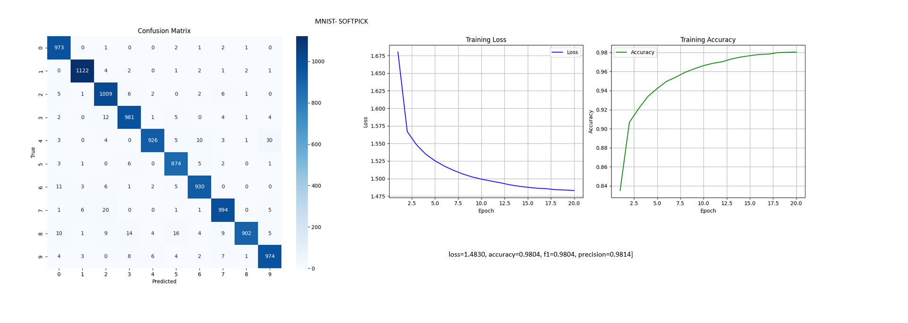
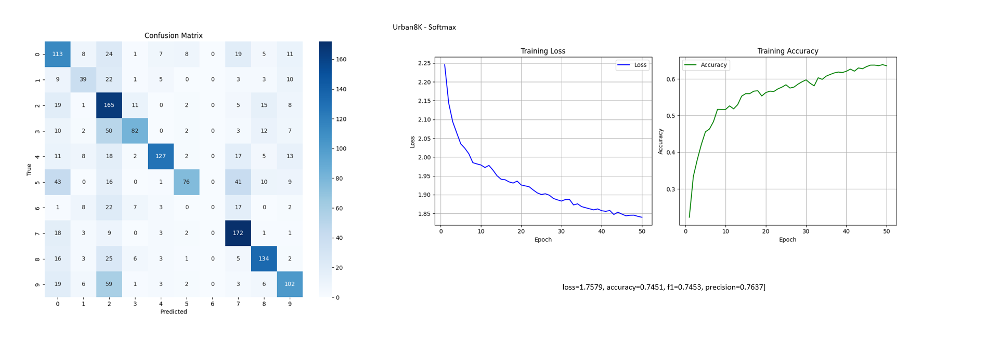
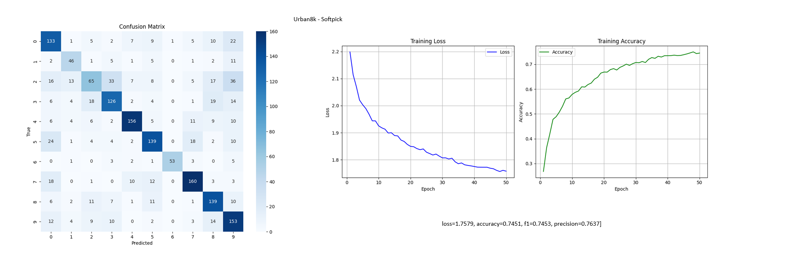

# audio-classification
torchaudio and associated libraries to build a DNN for audio classification

## Tackling the problem as a Computer Vision and Image Processing problem

We tackle the problem as vision problem rather than working in 1D waveform. We create mel spectrograms from the audio and perform the classification of audios

Using the Urban8K dataset for classification. 
[Link](https://urbansounddataset.weebly.com/urbansound8k.html) 

Excellent resource for leanring audio signal processing can be found here
[Link](https://www.youtube.com/@ValerioVelardoTheSoundofAI) 

# Comparing the new function, Softpick with Softmax.
A new function has been published called softmax, and I comparison was essentional with softmax, the typical function 
we have been using for ages!

[Softpick Paper Link](https://www.arxiv.org/pdf/2504.20966)
[1- Pytorch Implementation](https://github.com/nkapila6/softpick/blob/main/softpick.py)
[2- Pyorch Implementation](https://github.com/wajihullahbaig/softpick/tree/softpick-class)

# Comparison for MNIST dataset for Softmax and Softpick

    

# Comparison for Urban8K dataset for Softmax and Softpick

    